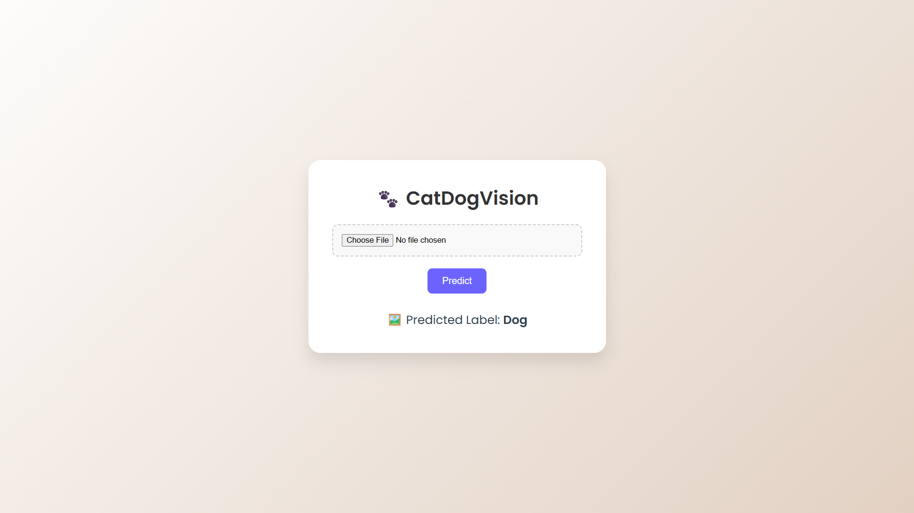

# 🐾 CatDogVision

**CatDogVision** is an image classification project that predicts whether an uploaded image is a **Cat** or a **Dog** using a trained **SVM (Support Vector Machine)** model. It features a fully modular Python backend, a modern Flask web interface, and Jupyter-based training/testing workflows.

---

## 📁 Project Structure

```
CatDogVision/
├── Module/
│   ├── svm_model.py         # SVM model implementation
│   ├── preprocessor.py      # Preprocessing utilities
│   └── main.py              # Terminal interface to test predictions
│
├── catdog/
│   ├── app.py               # Flask web app
│   ├── static/
│   │   └── style.css        # Custom CSS styles
│   ├── templates/
│   │   └── index.html       # Web UI template
│   └── requirements.txt     # Python dependencies
│
├── train and test/
│   └── CatDog_TrainTest.ipynb   # Jupyter notebook for training and testing the model
│
└── README.md               # Project documentation
```

---

## 🚀 How It Works

### 🔧 Model Summary

- The model uses an **SVM classifier** trained on Cat and Dog image datasets.
- Image features are extracted using preprocessing modules.
- Two modes of interaction:
  - CLI-based predictions
  - Web-based predictions (via Flask)

---

## 🖥️ Usage Guide

### ✅ 1. Terminal-Based Prediction

Navigate to the `Module/` folder:

```bash
cd Module
python main.py
```

* The script checks for `downloaded_image.jpg` and predicts whether it's a cat or dog.
* Modular design makes it easy to extend or reuse components.

---

## 📸 Screenshots

Here’s a glimpse of the web interface in action:



### 🌐 2. Web-Based Prediction (Flask)

Navigate to the `catdog/` folder:

```bash
cd catdog
python app.py
```

* Visit [http://127.0.0.1:5000](http://127.0.0.1:5000)
* Upload an image through the web UI
* View prediction results with stylish visual feedback

> Make sure all required packages are installed:

```bash
pip install -r requirements.txt
```

---

### 📊 3. Training & Testing

In the `train and test/` folder, open the notebook:

```bash
jupyter notebook train_and_test.ipynb
```

* Walkthrough includes:

  * Data loading and augmentation
  * Model training and evaluation
  * Accuracy and classification reports

---

## 🧰 Technologies Used

* Python
* Scikit-learn
* OpenCV
* NumPy
* Flask
* Jupyter Notebook

---

## 📌 Notes

* This project assumes pre-trained model and required images are placed in correct directories.
* Uploaded images in the Flask app are automatically deleted after prediction to manage storage.

---

## 📬 Contact

For queries, suggestions, or collaborations, feel free to reach out via my portfolio:

🔗 [contact me:](https://myporfolio-1o1h.onrender.com/contact)

---

## 🙌 Author

**Jison Joseph Sebastian** 
B.Tech Computer Science, Vimal Jyothi Engineering College
Machine Learning & AI Enthusiast 🚀


---


